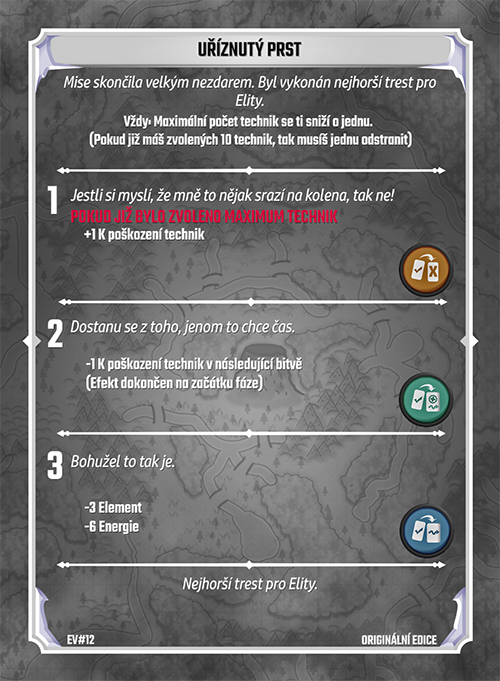

# Exportér layoutu karet

Tento program je napsán v Game Makeru a slouží k snadnému exportu layoutu karet pro deskovou hru určenou pro vlastní účely.

## Funkce

- **Snadný export**: Umožňuje rychlý a jednoduchý export layoutu karet.
- **Přizpůsobitelné hodnoty**: Podporuje různé hodnoty karet se stejnými vizuálními prvky.
- **Automatické generování layoutů**: Vytváří layouty na základě obrázků přidaných do specifické složky.
- **Export ve formátu A4**: Výstup je optimalizován pro tisk na formát A4.
- **Zarovnání rubu karet**: Rubové strany karet jsou zarovnány opačně pro snadnější tisk a následné zpracování.
- **Podpora různých barev elementů**: Každý element může mít jinou barvu, což umožňuje tisknout více variant s minimálními změnami.

## Poznámka

Veškeré prvky zobrazené na obrázku (žetony, layout, text) jsou mé vlastní tvorby. Vnitřní obrázky byly vytvořeny pomocí umělé inteligence, kterou jsem vytrénoval na základě mých vzorů, aby splňovaly požadované specifikace.
